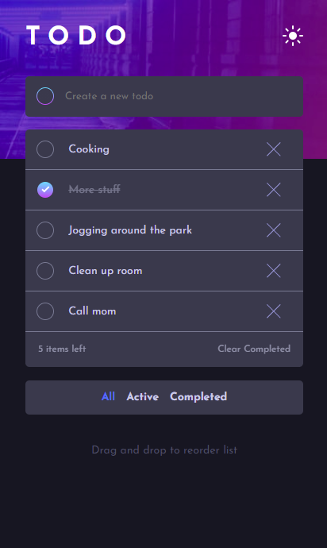
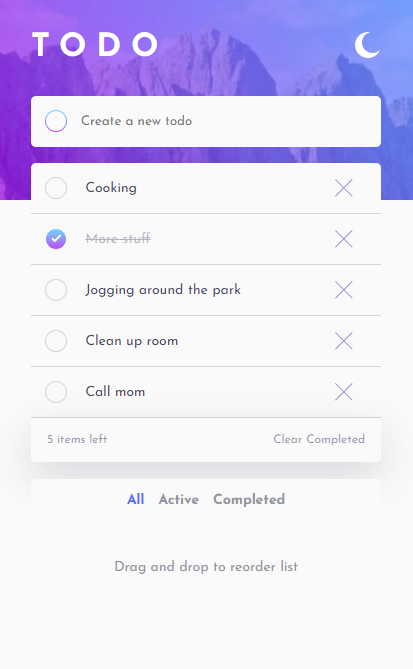

This is a solution to the [Todo app challenge on Frontend Mentor](https://www.frontendmentor.io/challenges/todo-app-Su1_KokOW). 

### The challenge

Users should be able to:

- View the optimal layout for the app depending on their device's screen size
- See hover states for all interactive elements on the page
- Add new todos to the list
- Mark todos as complete
- Delete todos from the list
- Filter by all/active/complete todos
- Clear all completed todos
- Toggle light and dark mode
- Drag and drop to reorder items on the list

### Screenshot

### Links

- Solution URL: [frontendmentor.io/solutions/mobile-first-HfC4BXasQ](https://www.frontendmentor.io/solutions/mobile-first-HfC4BXasQ)
- Live Site URL: [joakimgit.github.io/Todoapp/](https://joakimgit.github.io/Todoapp/)

### Built with

- Semantic HTML5 markup
- CSS custom properties
- Flexbox
- CSS Grid
- Mobile-first workflow
- Vanilla JavaScript

### What I learned

Going with a mobile first approach and making the application responsive was a first for me. It took longer than expected despite the small size of the project, but focusing on the CSS and making it work across different viewports was a good learning experience that I will employ more of in the future.